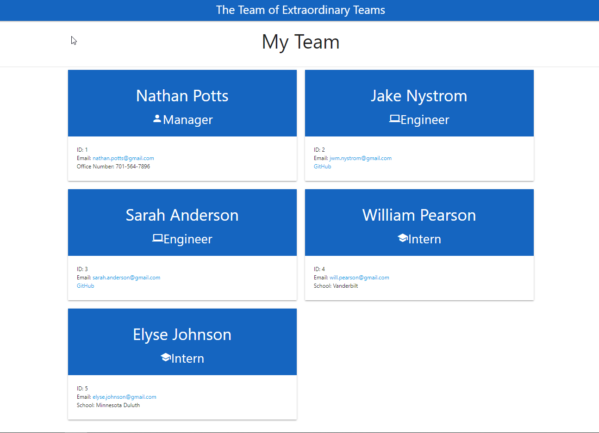

# Team Profile Generator

## Description

This application allows the end user to follow prompted questions that automatically generate an HTML page that displays their team. In this application there are three main constructors (Engineer, Intern, and Manager) that offer a series of prompted questions. These questions are invoked through the use of the inquirer package, and based on the constructor a different series of questions will be asked.

Once the prompts have been address by the end user, we use a write file package to dynamically generate an HTML file. This file is created through the use of template literals that exist within each consructor file for the different team members.

The constructors are build using Test Driven Development whis is validated and tested using Jest, a javascript testing framework. Data goes through a second validation screening within the inquirer prompts, which allows consistent results.

## Deployed

Watch Me: https://drive.google.com/file/d/1MkEgqYHLlpz5nU81XYHS4kWVqVWL_ei-/view

### Table of Contents

- [Usage](#usage)
- [NPM](#npm)
- [Usage](#how)
- [Contributing](#contributing)
- [Tests](#tests)
- [Questions](#questions)
- [About](#about)
- [Screenshot](#screenshot)

## Usage

```
AS A manager
I WANT to generate a webpage that displays my team's basic info
SO THAT I have quick access to their emails and GitHub profiles
```

## NPM Packages

- jest https://www.npmjs.com/package/jest
- inquirer https://www.npmjs.com/package/inquirer
- path https://www.npmjs.com/package/path
- fs https://www.npmjs.com/package/file-system

## How to Use

1. To install and use Team Profile Generator, the end user should clone this project to a location on their local machine.
2. Once the end user has cloned the repository, they should open the generator in their installed version of a text editor (Visual Studio).
3. After the repository has been opened, run "npm init" in the terminal of thetext editor, or in the open terminal as long as the file path is at the root of the project. This will initialize the creation of a .json package (be sure to follow the prompts).
4. The final step to installing the Team Profile Generator will be to run "npm install inquirer" in the terminal. This step will install the inquier package into the node_modules folder.

**To run the program, write 'node index.js' in the terminal. Be sure to validate that the terminal is pointed to the program root**

## Contributing

Nathan Potts

## Tests

Make sure to follow the prompts. If there is a requirement to document a field, that means it is neccesary data for the Readme Generator to run. If the prompt does not have a requirment listed, test this by leaving the data entry blank and moving on to the next section.

## Questions

Thanks for looking at Readme Generator, my name is Jake Nystrom! If you would like to reach me, feel free to write to jwm.nystrom@gmail.com. I will look forward to hearing from you!

## About the Author

Today, as a motivated and goal oriented individual I embrace challenges, strive to help others learn and develop, work collaboratively with teams, and push myself to further develop my current skill set with an expectation to succeed. I thrive in high paced environments where teams are setup for success.

## Screenshot


